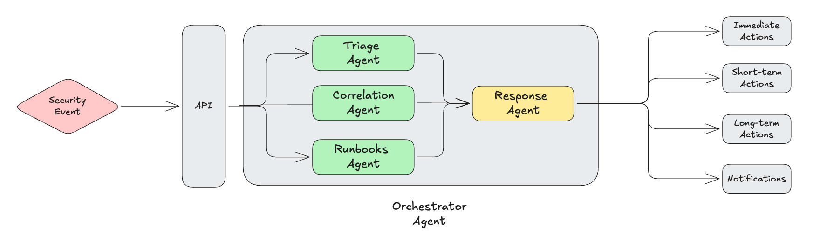

# AI Event Processor

The AI Event Processor is a multi-agent Event-Driven Agentic Workflow designed to assist with processing security events. It leverages Google's **Agent Development Kit (ADK)** and **Gemini** models to provide expert advice on real-time event processing. This repo is inspired from this [ADK Go Sample](https://github.com/google/adk-samples/tree/main/go/agents/sail-researcher).

## Architecture

The application is built as a Go web server that orchestrates a team of specialized AI agents:



The Orchestrator agent launches 3 parallel agents: Triage, Correlation and Runbooks to operate on the incoming seurity events. The Response agent uses the output of the parallel agents to produce immediate, short-term and long term actions in addition to notifications. 

### Technical Stack

*   **Language**: Go (1.23+)
*   **Framework**: [Google Agent Development Kit (ADK)](https://github.com/googleapis/agent-development-kit)
*   **AI Model**: Google Gemini (via Vertex AI or AI Studio).
*   **Observability**: Structured JSON logging (`log/slog`) and Google Cloud Trace integration.

## Prerequisites

*   Go 1.23 or higher.
*   A Google Cloud Project.
*   API Keys for Google Gemini API or Google Vertex

## Google Vertex

The reason we want to use Google Vertex as opposed to Gemini API Key is because of the tool argument handling. The issue is with how we're using `functiontool.New()`. This is a known compatibility issue between the ADK's automatic schema generation and certain Gemini AP variants.

The `functiontool.New()` helper uses reflection to automatically generate a genai.Schema from your Go structs (`WeatherArgs` and `WeatherResult`). Depending on how it generates the schema,
it might be using `ParametersJsonSchema` or other fields that aren't supported by Gemini API (even though they work on Vertex AI).

From the ADK code at `tool/functiontool/functiontool.go`, the automatic schema generation can create schemas that are incompatible with Gemini API's function calling.


**Step 1**: Install Google Cloud CLI

If you don't have it already:

```bash
  brew install google-cloud-sdk
```

Or download from https://cloud.google.com/sdk/docs/install

**Step 2**: Authenticate with Google Cloud

This opens a browser for you to log in with your Google account

```bash
  gcloud auth application-default login
```

This creates credentials at `~/.config/gcloud/application_default_credentials.json` that the
ADK will automatically use.

**Step 3**: Set Your Google Cloud Project

Replace with your actual GCP project ID
```bash
  gcloud config set project YOUR_PROJECT_ID
```

Or set it as an environment variable
```bash
  export GOOGLE_CLOUD_PROJECT=YOUR_PROJECT_ID
```

**Step 4**: Enable Vertex AI API

Enable the Vertex AI API for your project
```bash
  gcloud services enable aiplatform.googleapis.com
```

**Step 5**: Set the Environment Variable

In your terminal or add to ~/.zshrc or ~/.bashrc
```bash
  export GOOGLE_GENAI_USE_VERTEXAI=1
  export GOOGLE_CLOUD_PROJECT=YOUR_PROJECT_ID
```

Or in your .env file (make sure your app loads it)
```bash
  GOOGLE_GENAI_USE_VERTEXAI=1
  GOOGLE_CLOUD_PROJECT=YOUR_PROJECT_ID
```

**Step 6**: Remove GOOGLE_API_KEY

When using Vertex AI, you don't use GOOGLE_API_KEY:

```bash
  ### In your .env file:
  ### GOOGLE_API_KEY=...  ← Comment this out or remove it
```

```bash
  GOOGLE_GENAI_USE_VERTEXAI=1
  GOOGLE_CLOUD_PROJECT=your-project-id
```

## Setup

1.  **Clone the repository**:
    ```bash
    git clone <repository-url>
    cd ai-event-processor
    ```

2.  **Configure Environment**:
    Create a `.env` file in the root directory with the following variables:

    ```env
    GEMINI_API_KEY=your-gemini-api-key
    GOOGLE_GENAI_USE_VERTEXAI=1
    GOOGLE_CLOUD_PROJECT=<id>
    ENV=development
    PORT=8081
    MODEL=gemini-2.5-flash
    ```

## Running the Server

Start the agent server:

```bash
go run .
```

Or build and run the binary:

```bash
go build -o server .
./server
```

The server listens on port `8081` (default).

## Interactive Testing

Start the test script to send multiple events to the AI layer over its API Endpoint and see the response:

```bash
cd scripts
go run test-events.go
```

### Event Input Pattern

**Note:** The current implementation follows a two-step pattern for sending events:

1. **Create/Update Session with State**: Event JSON is stored in session state via the session creation endpoint
2. **Run Agent**: Agent accesses the event via `{event_data}` template variable

This is due to a **known ADK limitation**: The `stateDelta` field in the `/api/run` REST API endpoint is defined but not actually processed by the runtime controller (as of the current ADK version).

**Current Workaround** (see `scripts/test-events.go`):
```go
// Create session with event data in initial state
sessionPayload := map[string]interface{}{
    "state": map[string]interface{}{
        "event_data": string(eventJSON),
    },
}
// POST to /api/apps/{appName}/users/{userId}/sessions/{sessionId}

// Then run the agent
// POST to /api/run
```

**Future Improvement**: Once ADK implements `stateDelta` processing, we can simplify to a single API call with the event payload included directly in the request.

**Reference**: See `ADK-GO-DEEP-DIVE.md` lines 5232-5309 for detailed documentation of this limitation.

## Unit Testing

Run the Go unit tests for all packages:

```bash
go test ./...
```

